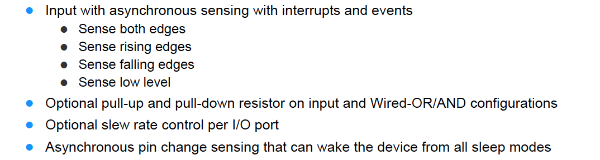

# Electrical Watch Design (Version Andrew)

## Initial Block Diagram

The Electrical Watch Design in the beginning and now is very simple. I only had a week and a half to build it, knowing nothing about the PCB or embedded programming process, so I made it as easy as I possible could: A two layer board that had the clock, RTC, and Button to turn on the lights.


## Component Selection

I spent a lot of time looking at different components, but we can break it up:

### Microcontroller


**Requirements**
* Handles 1.6V to 3V due to battery

* Low Power Consumption During Sleep

* Ability to handle a Real Time Clock During Sleep

* Able to sink or source 2mA of current (Current draw decided by LED decision)
 * Atxmega16E5 is able to source more than 2mA
 
* At least 22 GPIO Pins
 * Atxmega16e5 had 24
 
* At least one interrupt pin to wake from power save mode
 * Atxmega16e5 had synchronous interrupts on every pin and asynchronous interrupts on pin 2 of every port
 
* Needed to be coded through avrdude (No Budget for proprietary software)
 * The Atxmega16e5 was compatible on the Linux version of avrdude and avrgcc

### LEDs

#### Requirements

* High Efficiency Design
* Low cost (We'd be buying over a 100 per PCB)
* Available in 0603 or 0402 (Only 2mmx2mm given per LED)

#### Solution

We ended up experimenting with a couple different kinds of LEDs

**LED1**


**LED2**


We ended up going with the LED that was more easily solderable

### Crystal And Capacitors

* Crystal needed to be low-profile and 32KHz

We ended up using [this crystal](http://www.mouser.com/ProductDetail/ABRACON/ABS07-32768KHZ-7-T/?qs=2nyfZ6BV3oibNEFok2qBLA%3D%3D).

Capacitor selection was done by:

```
C_1, C_2 = 2 * C_L - 2 * C_{stray}
```

Where C_1 and C_2 are capacitors we add onto the sides of the crystal, C_L is the crystal load (given), and C_stray is 2pF - 5pF.

We also chose a dielectric that was temperature stable (I believe it was C0) for the capacitor load.  

We chose X7R or X5R capacitors to decouple the power supply. 

### Battery

We needed as thin of a battery as possible that would be able to slide in and out of the battery. The batteries that were less known had fewer off-the-shelf modules.

Batteries are defined by CRXXYY, where XX is the diameter and YY is the height, both in mm.

* CR1620: 75mAH Total: 3.43mm
* CR2025: Low height
* CR1632: 125mAH Total: 4.33mm
* CR2032: 210mAH and cheaper due to being a standard part

I ended up with the CR2032 because it just worked.
