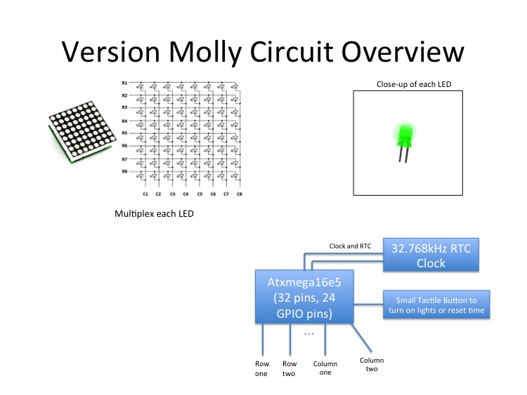
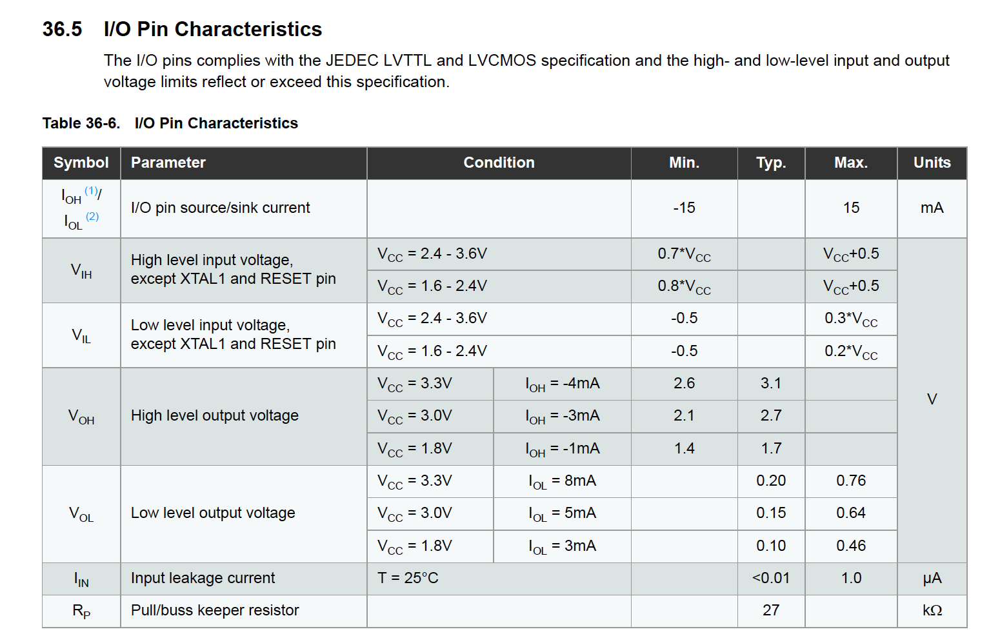
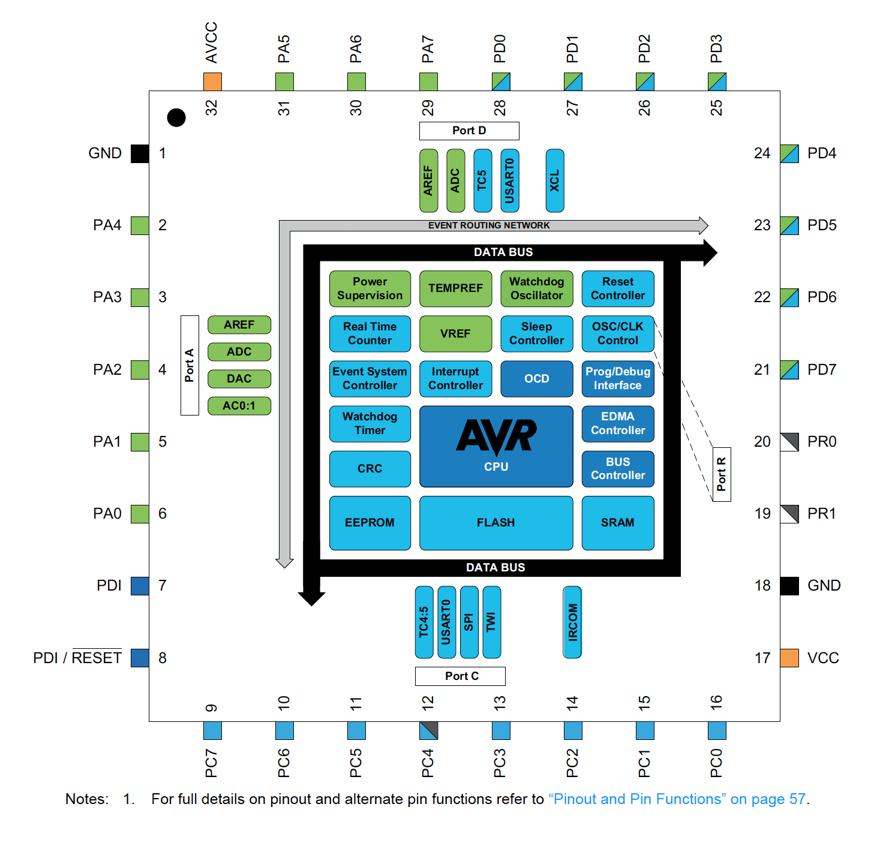
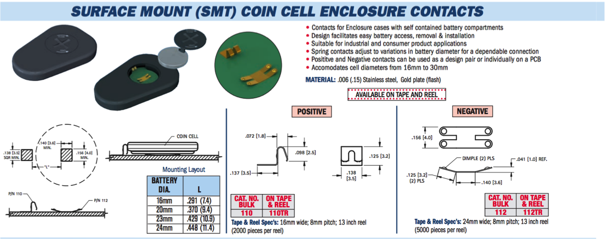

# Electrical Watch Design (Version Molly)

## Initial Block Diagram

This iteration of the watch had to handle multiple languages, Spanish for Molly, English for me. Hence we looking into multiplexing and charlieplexing. Overall, the design was the same except for a few changes. Only the changes will be documented here.

## Component Selection (Version Andrew)

I spent a lot of time looking at different components, but we can break it up:

### Microcontroller

**Requirements for new iteration**

* Able to sink or source 5mA of current (Current draw decided by LED decision)
 * Atxmega16E5 was not able to, unless we had a higher voltage (Problem faced by me)
 
* At least 10 GPIO Pins
 * Atxmega16e5 had 24
 

### LEDs

#### Requirements

* Able to withstand reverse voltage (Sounds stupid to ask for in a diode, but we actually had a problem where the LED was not meant for reverse voltage.)
* Able to withstand high current pulses
* Low reverse current
* 0603. 0402 was too small and didn't have as large of a diffusion as I wished.
* Low Price, High Lux

#### Solution

We found the best LED to be [this one (Need to double check this isn't the bad reverse voltage one)](http://www.mouser.com/Search/ProductDetail.aspx?R=LW_VH8G-Q2OO-4M6N-1-Zvirtualkey62510000virtualkey720-LWVH8G-Q2S24M6N1)

### Battery

The current way we were holding the battery was too difficult to remove. I wanted something that required constant contact on all sides but also was low profile. We ended up with this battery holder.
